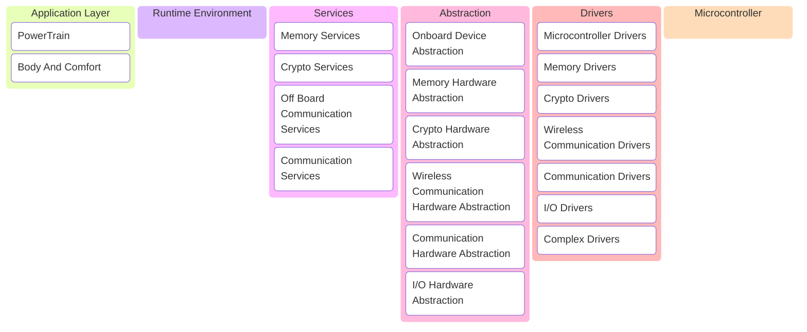

+++
title = 'AUTOSAR'
date = 2024-09-10T20:10:19+08:00
categories = ['Project']
tags = ['Embedded']
draft = false
+++

> AUTOSAR学习指南

<!--more-->

> 文档阅读指南

| 缩写   | 详细含义                           | 解释                       |
| ------ | ---------------------------------- | -------------------------- |
| `EXP`  | Explation                          | 解释说明性的文档，优先阅读 |
| `RS`   | Requirement Specification          | 详细描述需求规范           |
| `SRS`  | Software Requirement Specification | 软件需求规范               |
| `SWS`  | Software   Specification           | 软件规范                   |
| `TPS`  | Template Specification             | 模板规范                   |
| `TR`   | Technical Report                   | 技术规范详细介绍           |
| `MOD`  | Model                              | 建模                       |
| `MMOD` | Meta Model                         | 元模型                     |

---

