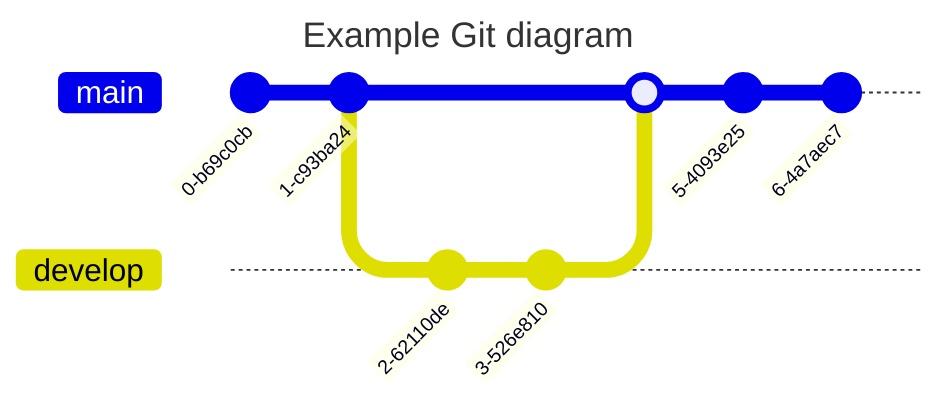

+++
title = 'Git使用指南'
date = 2025-06-07T08:11:45+08:00
draft = false
categories = ['Project']
tags = ['Embedded']
+++

---

> Git使用指南
<!--more-->

- [1.Git下载](#1git下载)
- [2.Git基础](#2git基础)
- [3.Git分支](#3git分支)
- [4.服务器上的Git](#4服务器上的git)
- [5.分布式Git](#5分布式git)

## 1.Git下载

参考 [^1]为官方文档

> 相关的案例

在 Mermaid 中，我们支持基本的 git 操作，例如：

* commit ：代表当前分支上的新提交。

* 分支 ：创建并切换到新分支，将其设置为当前分支。

* checkout ：签出现有分支并将其设置为当前分支。

* merge ：将现有分支合并到当前分支。

## 2.Git基础

## 3.Git分支

## 4.服务器上的Git

## 5.分布式Git

[^1]: https://git-scm.com/book/zh/v2