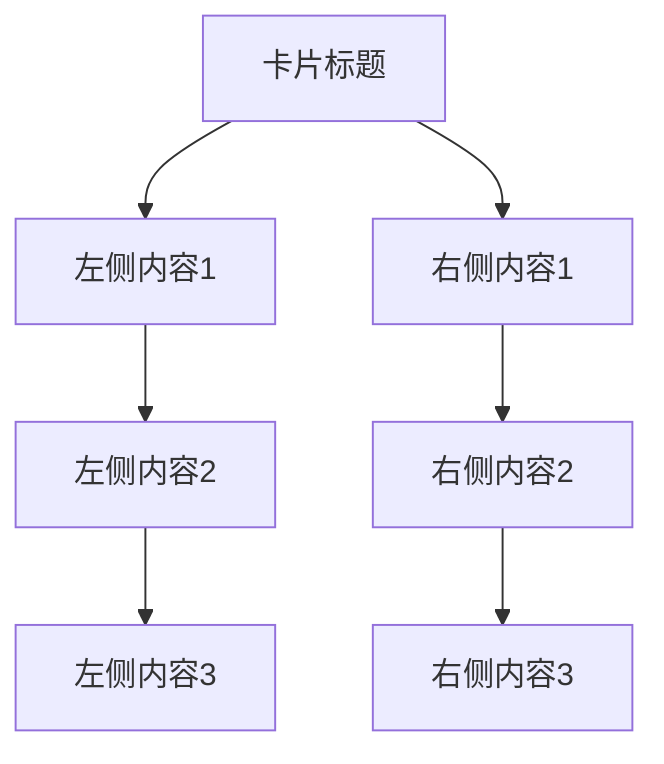
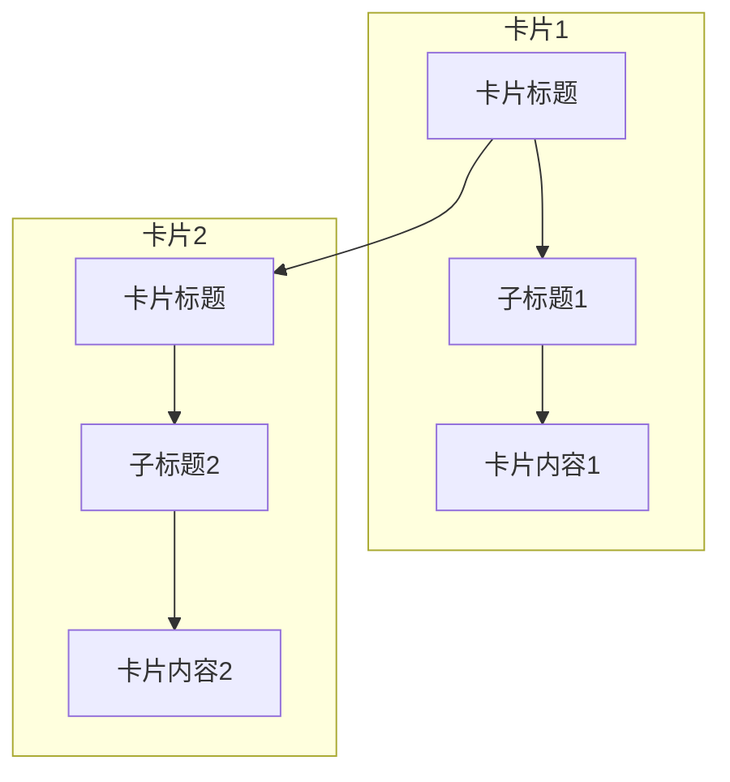
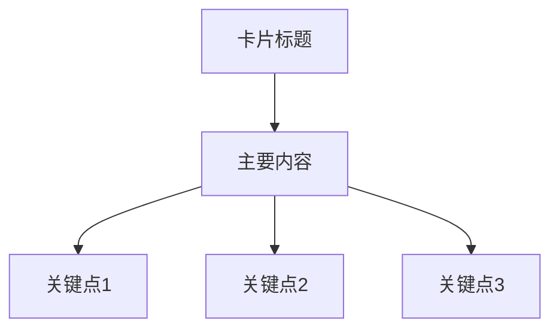
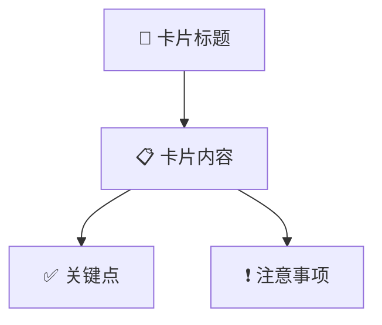
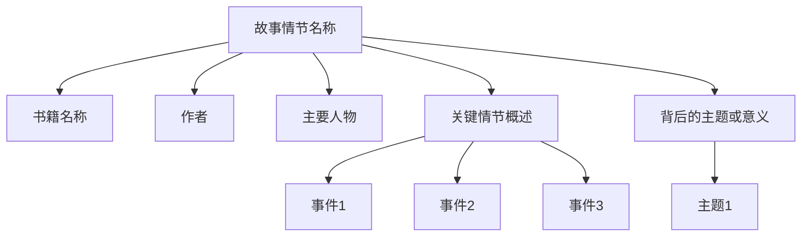
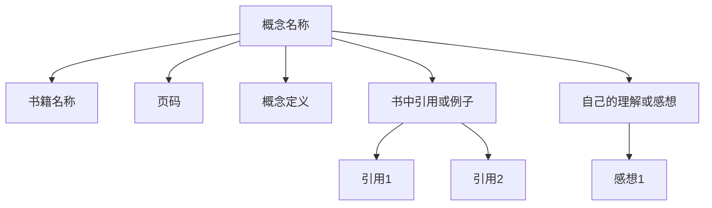

+++
title = '卡片笔记'
date = 2024-09-08T21:01:43+08:00
draft = false
+++

> 卡片笔记模板

<!--more-->

 

```mermaid
graph TD
    A[卡片标题] --> B1[左侧内容1]
    A --> B2[右侧内容1]
    B1 --> C1[左侧内容2]
    B2 --> C2[右侧内容2]
    C1 --> D1[左侧内容3]
    C2 --> D2[右侧内容3]
```

```mermaid
graph TD
    subgraph 卡片1
        A1[卡片标题] --> B1[子标题1]
        B1 --> C1[卡片内容1]
    end
    subgraph 卡片2
        A2[卡片标题] --> B2[子标题2]
        B2 --> C2[卡片内容2]
    end
    A1 --> A2

```

```mermaid
graph TD
    A[卡片标题] --> B[主要内容]
    B --> C[关键点1]
    B --> D[关键点2]
    B --> E[关键点3]
```

```mermaid
graph TD
    A["📝 卡片标题"] --> B["📋 卡片内容"]
    B --> C["✅ 关键点"]
    B --> D["❗ 注意事项"]

```

---

> 读书笔记卡片

```mermaid
graph TD
    A[故事情节名称] --> B[书籍名称]
    A --> C[作者]
    A --> D[主要人物]
    A --> E[关键情节概述]
    E --> E1[事件1]
    E --> E2[事件2]
    E --> E3[事件3]
    A --> F[背后的主题或意义]
    F --> F1[主题1]
```

```mermaid

graph TD
    A[概念名称] --> B[书籍名称]
    A --> C[页码]
    A --> D[概念定义]
    A --> E[书中引用或例子]
    E --> E1[引用1]
    E --> E2[引用2]
    A --> F[自己的理解或感想]
    F --> F1[感想1]

```